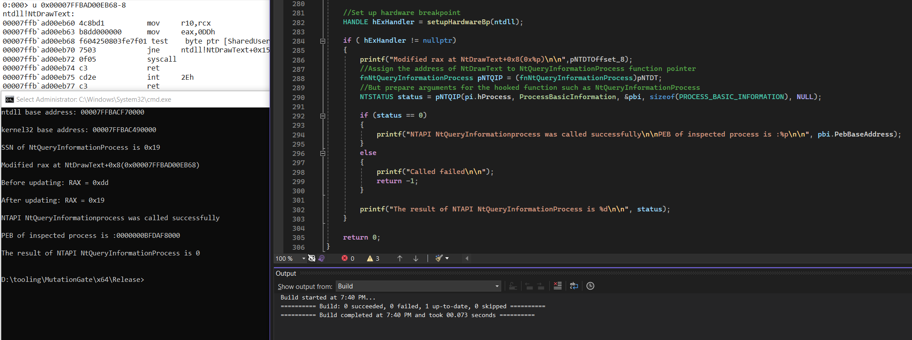

# MutationGate
MutationGate is a new approach to bypass EDR's inline hooking by utilizing hardware breakpoint to redirect the syscall.

It works by calling an unhooked NTAPI and replacing the unhooked NTAPI's SSN with hooked NTAPI's. In this way, the syscall is redirected to the hooked NTAPI's, and the inline hook can be bypassed without loading the 2nd ntdll module or modifying bytes within loaded ntdll's memory space. 

The provided project is only a `POC`, not a comprehensive implementation. For instance, you could use this approach to set hardware breakpoints for a set of functions. 

The function can also be WIN32API. For instance, we can set the 1st hbp at `DrawText` to redirect the execution to `NtDrawText`, and the 2nd hbp replaces the SSN saved in RAX. In this way, module `kernel32.dll` is not skipped, and the call stack looks more legitimate. 

## Description
EDR tends to set inline hooks for various NTAPI, especially those are usually leveraged in malware, such as `NtAllocVirtualMemory`, `NtOpenProcess`, etc. While other NTAPI that are not usually leveraged in malware tend not to have inline hook, such as `NtDrawText`. It is very unlikely that an EDR set inline hook for all NTAPI.   

Assume NTAPI `NtDrawText` is not hooked, while NTAPI `NtQueryInformationProcess` is hooked, the steps are as follows:

1. Get the address of `NtDrawText`. It can be achieved by utilizing `GetModuleHandle` and `GetProcAddress` combination, or a custom implementation of them via PEB walking.
```c
  pNTDT = GetFuncByHash(ntdll, 0xA1920265);	//NtDrawText hash
  pNTDTOffset_8 = (PVOID)((BYTE*)pNTDT + 0x8);	//Offset 0x8 from NtDrawText
```
2. Prepare arguments for `NtQueryInformationProcess`
3. Set a hardware breakpoint at `NtDrawText+0x8`, when the execution reaches this address, SSN of `NtDrawText` is saved in RAX, but syscall is not called yet.

```windbg
0:000> u 0x00007FFBAD00EB68-8
ntdll!NtDrawText:
00007ffb`ad00eb60 4c8bd1          mov     r10,rcx
00007ffb`ad00eb63 b8dd000000      mov     eax,0DDh
00007ffb`ad00eb68 f604250803fe7f01 test    byte ptr [SharedUserData+0x308 (00000000`7ffe0308)],1
00007ffb`ad00eb70 7503            jne     ntdll!NtDrawText+0x15 (00007ffb`ad00eb75)
00007ffb`ad00eb72 0f05            syscall
00007ffb`ad00eb74 c3              ret
00007ffb`ad00eb75 cd2e            int     2Eh
00007ffb`ad00eb77 c3              ret
```
4. Retrieve the SSN of `NtQueryInformationProcess`. Inside the exception handler, update RAX with NtQueryInformationProcess' SSN. I.e., the original SSN was replaced.
```c
...<SNIP>...
PVOID GetFuncByHash(IN HMODULE hModule, uint32_t Hash)
{
	PBYTE pBase = (PBYTE)hModule;
	PIMAGE_DOS_HEADER	pImgDosHdr = (PIMAGE_DOS_HEADER)pBase;
	if (pImgDosHdr->e_magic != IMAGE_DOS_SIGNATURE)
		return NULL;
	PIMAGE_NT_HEADERS	pImgNtHdrs = (PIMAGE_NT_HEADERS)(pBase + pImgDosHdr->e_lfanew);
	if (pImgNtHdrs->Signature != IMAGE_NT_SIGNATURE)
		return NULL;

	IMAGE_OPTIONAL_HEADER	ImgOptHdr = pImgNtHdrs->OptionalHeader;
	PIMAGE_EXPORT_DIRECTORY pImgExportDir = (PIMAGE_EXPORT_DIRECTORY)(pBase + ImgOptHdr.DataDirectory[IMAGE_DIRECTORY_ENTRY_EXPORT].VirtualAddress);
	PDWORD FunctionNameArray = (PDWORD)(pBase + pImgExportDir->AddressOfNames);
	PDWORD FunctionAddressArray = (PDWORD)(pBase + pImgExportDir->AddressOfFunctions);
	PWORD  FunctionOrdinalArray = (PWORD)(pBase + pImgExportDir->AddressOfNameOrdinals);
	for (DWORD i = 0; i < pImgExportDir->NumberOfFunctions; i++) 
	{
		CHAR* pFunctionName = (CHAR*)(pBase + FunctionNameArray[i]);
		PVOID pFunctionAddress = (PVOID)(pBase + FunctionAddressArray[FunctionOrdinalArray[i]]);
		if (Hash == ROR13Hash(pFunctionName)) 
		{
			return pFunctionAddress;
		}
	}
	return NULL;
}
...<SNIP>...
```
5. Since we called `NtDrawText` but with `NtQueryInformationProcess`' arguments, the call should be failed. However, since we changed the SSN, the syscall is successful. 
```c
		fnNtQueryInformationProcess pNTQIP = (fnNtQueryInformationProcess)pNTDT;
		NTSTATUS status = pNTQIP(pi.hProcess, ProcessBasicInformation, &pbi, sizeof(PROCESS_BASIC_INFORMATION), NULL);	
```


## Example



In this example, NtDrawtext's SSN is `0xdd`, `NtQueryInformationProcess`' SSN is `0x19`, the address of NtDrawText is `0x00007FFBAD00EB60`

The call is made to NtDrawText's address, but with NtQueryInformationProcess. Since the SSN is changed from `0xdd` to `0x19`, the syscall is successful.

## Disclaimer
1. MutationGate is not an extension or variant of various Gate. Because those Gate focus more on retrieving SSN of NTAPI, MutationGate focuses on bypassing the inline hook in NTAPI.
2. MutationGate is able to bypass inline hook in NTAPI, however, the individual technique does not guarantee to bypass EDR, because EDR has multiple detection dimensions, inline hook is one of them.
3. The project is a POC, not a complete and comprehensive implementation.


## Advantages of MutationGate Approach
So far, some classic and common approaches to bypass EDR's inline hook include but are not limited to the following approaches:
1. Load the 2nd ntdll module
2. Copy a fresh ntdll's text section to overwrite hooked ntdll's text section
3. Overwrite hooked codes(syscall stub) with fresh code
4. More...

The above techniques involve the modification of loaded ntdll, or loading of the 2nd ntdll. These behaviors could be detected by EDR. 

While MutationGate is not the only approach that untouches loaded ntdll, it does have the advantage of not modifying the loaded ntdll module, which decreases the possibility of getting detected. 

And, it is very simple, no need to modify other registers, etc.


## Detection
It is possible to detect MutationGate technique.

1. The `AddVectoredExceptionHandler` call could look suspicious in a normal program.
2. In the POC, NTAPI is called directly, which could be weird in a normal program. However, it can be resolved by adding 1 more hardware breakpoint at `DrawText`, directing the execution to `NtDrawText` and triggering the 2nd hardware breakpoint that replaces SSN.
3. Call stack in kernel space could reveal clues.

## Credits and References
<https://cyberwarfare.live/bypassing-av-edr-hooks-via-vectored-syscall-poc/>

<https://redops.at/en/blog/syscalls-via-vectored-exception-handling>

<https://gist.github.com/CCob/fe3b63d80890fafeca982f76c8a3efdf>

<https://malwaretech.com/2023/12/silly-edr-bypasses-and-where-to-find-them.html>

Maldev Academy

## Other Approaches Utilized Hardware Breakpoint
<https://github.com/Dec0ne/HWSyscalls>

<https://github.com/rad9800/TamperingSyscalls>

<https://github.com/RedTeamOperations/VEH-PoC>
